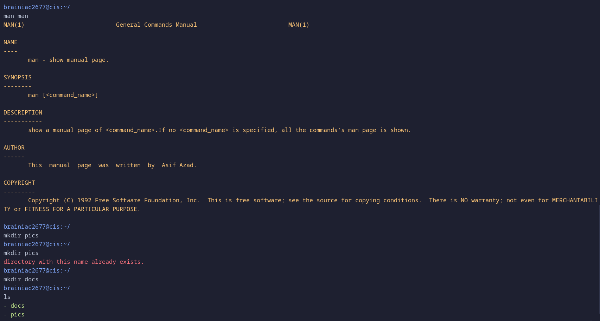
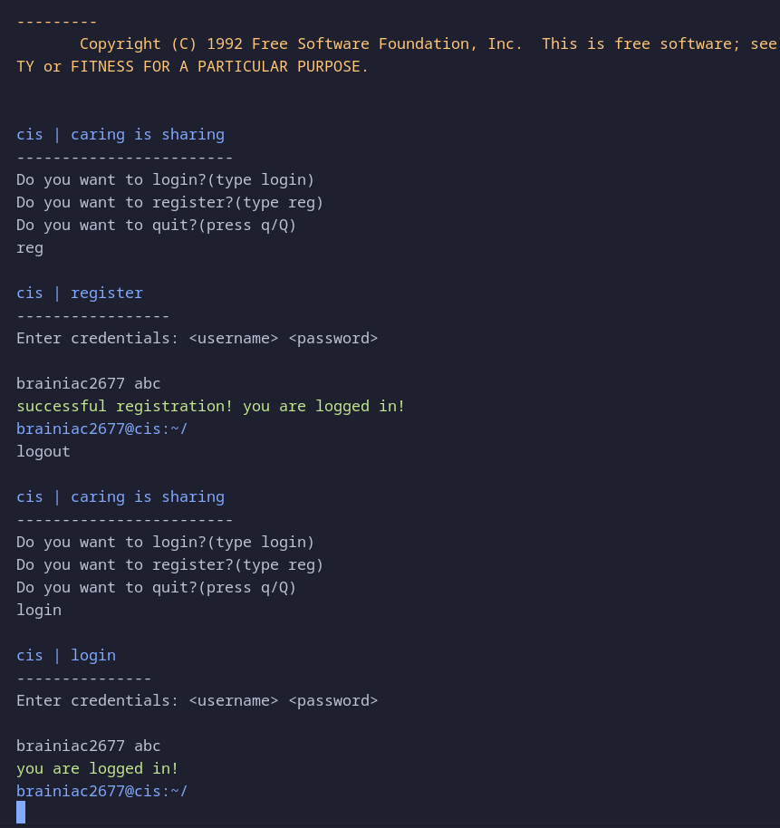
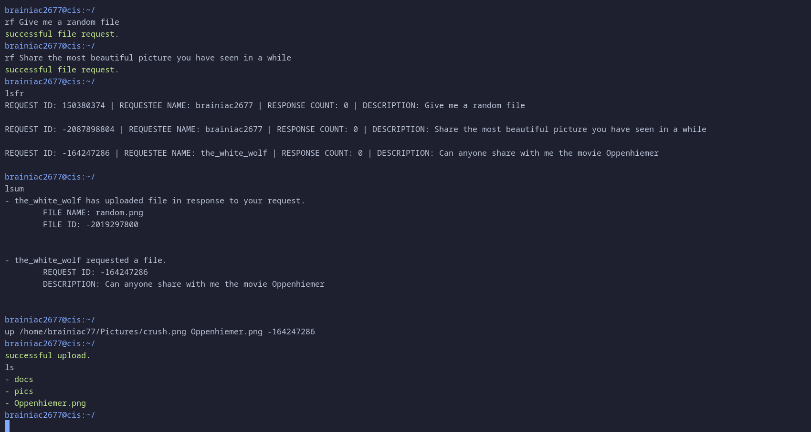
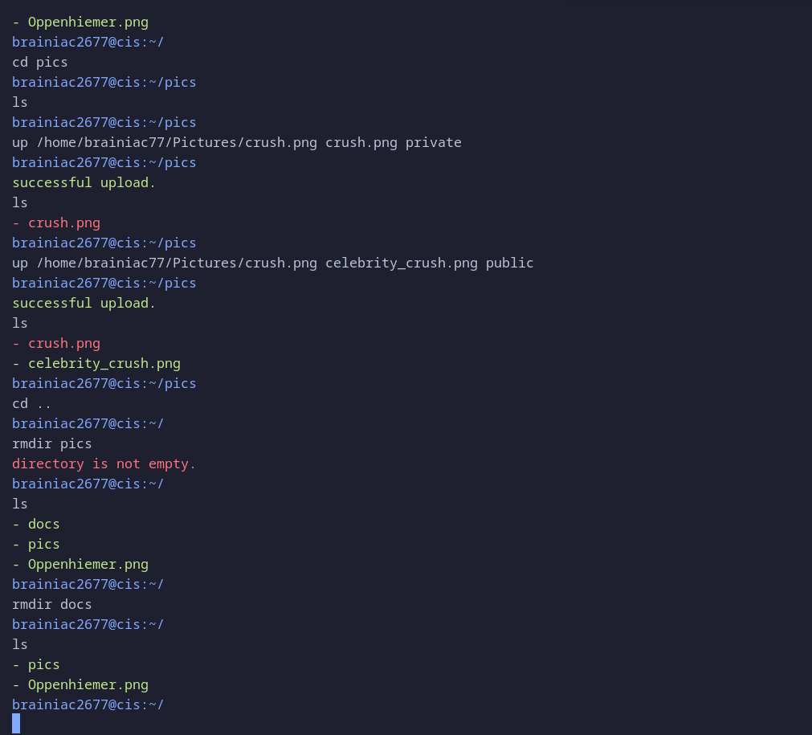

# CIS | `Caring Is Sharing`

`cse322 | Computer Networking`
 
CIS is a Java-based application that provides FTP (File Transfer Protocol) functionality for transferring files between a client and a server.

## Features

- Shell like CLI to interact with remote filesystem.
- Upload files from the client to the server
- Download files from the server to the client
- Having a personal filesystem on the server
- List files and directories on the server
- Create new directories on the server
- Delete directories on the server

## Running in VS code

 - Install java extension pack in VS code.
 - Clone the repository.
 - From the server device src folder [client folder](src/client) can be removed.
 - From the client device src folder [server folder](src/server) can be removed.
 - Initialize and run the server first from [ServerLoader.java](src/server/ServerLoader.java)  
 - Initialize and run as many clients as you want from [ClientLoader.java](src/client/ClientLoader.java) 

## Built with 
- love
- Java
- VS code 

## Design Patterns Used
Tried to incorporate some classical design patterns where needed.
- State Pattern
- Command Pattern
- Singleton Pattern

## Contributing

Contributions are welcome! If you have any ideas, suggestions, or bug reports, please open an issue or submit a pull request.

## License

This project is licensed under the [MIT License](LICENSE).

## Contact

For any inquiries or questions, please contact `asifazad0178@gmail.com`